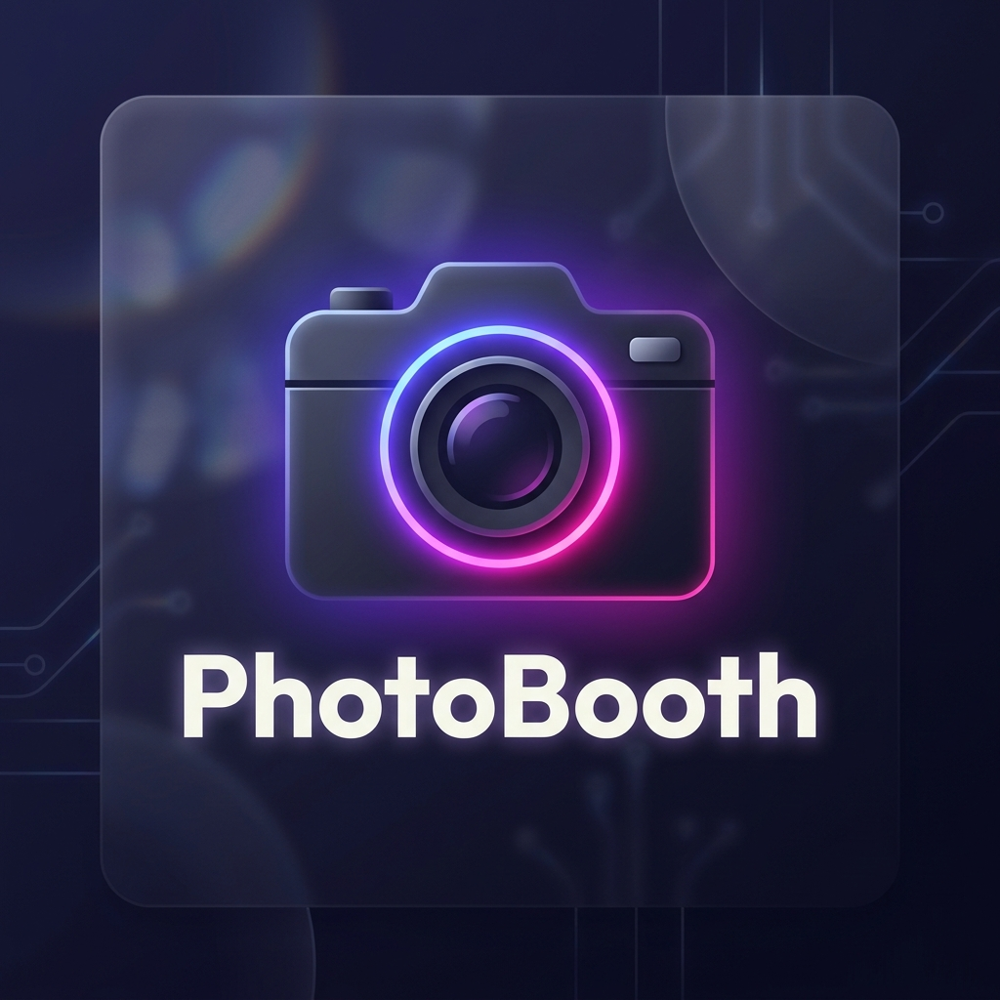

<p align="center">
  
</p>

<h1 align="center">PhotoBooth</h1>

<p align="center">
  <i>A simple, sincere space to capture and share your moments.</i>
</p>

<p align="center">
  
  
  
</p>

<p align="center">
  
  
</p>

---

### Hello! I'm Jemmy Francisco.
I built **PhotoBooth** because I wanted to create a place where capturing memories feels as natural as it does in person. It’s not just a camera app—it’s a small corner of the web where you can connect with friends, share a laugh through a digital film strip, and keep those snapshots in a clean, beautiful gallery.

I’ve focused on making the experience feel "light" and modern using glassmorphism, so it feels like you're interacting with something premium and well-crafted.

---

## 🚀 Getting Started
This project is a monorepo, meaning everything is in one place and easy to manage.

### To Run Locally:
1.  **Install everything**:
    ```bash
    npm install
    ```
2.  **Environment**: 
    - Set up your Firebase keys in `frontend/.env`.
    - Set up your `DATABASE_URL` in `backend/.env`.
3.  **Start Dev Mode**:
    ```bash
    npm run dev
    ```
    *This starts both the frontend and the backend automatically.*

### To Build for Production:
```bash
npm run build
```

---

## 📸 How it Works
*   **Sign In**: Jump in instantly with your Google account.
*   **The Studio**: Choose your favorite layout (Strip or Postcard) and start capturing.
*   **Friends**: Follow other creators. Once you’re connected, you’ll see when they’re online.
*   **Shared Sessions**: Invite an active friend to a live session and take photos together in real-time.
*   **Gallery**: Your last three prints are saved right on your dashboard for easy downloading.

---

## 📜 Version History
*   **v1.4.0**: **STABLE RELEASE** — Professional Filter Engine, Lens Bar, and Smart Notifications.
*   **v1.3.5**: Individual notification controls and dashboard gallery optimization.
*   **v1.3.0**: The "Premium Update" — Glassmorphism UI and real-time status.
*   **v1.2.0**: Migrated to a stable Monorepo structure.
*   **v1.0.0**: Initial launch of the core camera and social features.

---
**Crafted with care by Jemmy Francisco**  
*Always learning, always building.*
